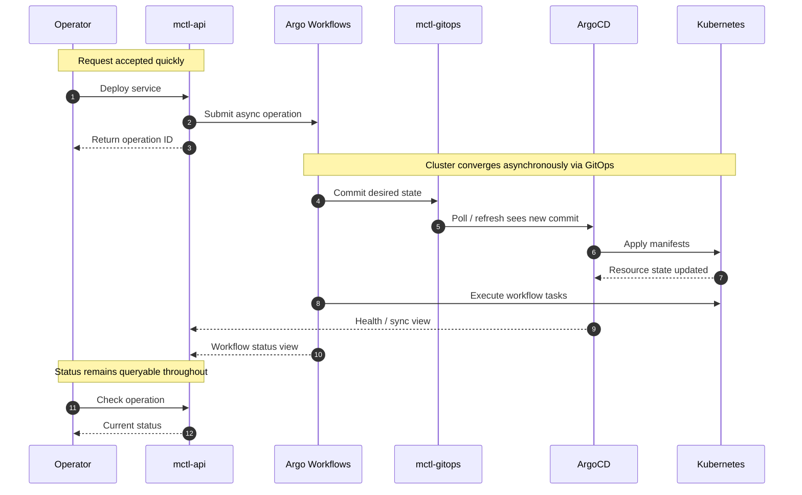

# GitOps Workflows

Every infrastructure change in MCTL flows through Git. ArgoCD watches the `mctl-gitops` repository and syncs the cluster to match the desired state.

## How GitOps Works in MCTL



## Argo Workflows

Long-running operations (deploy, scale, rollback) are executed as Argo Workflows. You can:

### List Workflows

```
"Show me running workflows in staging"
```

### Check Workflow Status

```
"What's the status of workflow deploy-my-app-xyz?"
```

Workflow UI is available at [workflows.mctl.ai](https://workflows.mctl.ai).

## Repository Structure

The `mctl-gitops` repository is organized by tenant:

```
platform-gitops/
  services/
    admins/           # Platform services (mctl-api, mctl-web, etc.)
      mctl-api/
      mctl-web/
      mctl-docs/
    tenants/
      team-alpha/     # Tenant-scoped services
        my-app/
        my-api/
      team-beta/
        ...
```

## CI/CD Integration

When you push a tag to a service repository:

1. **CI builds** the Docker image and pushes to `ghcr.io/mctlhq/{repo}:{tag}`
2. **CI updates** `mctl-gitops` with the new image tag
3. **ArgoCD syncs** the change to the cluster

This pattern is used by all MCTL platform services and is available for tenant services.

## Grant Repository Access

To connect a GitHub repository to a tenant for automated deployments:

```
"Grant access to repo myorg/my-app for the staging tenant"
```
