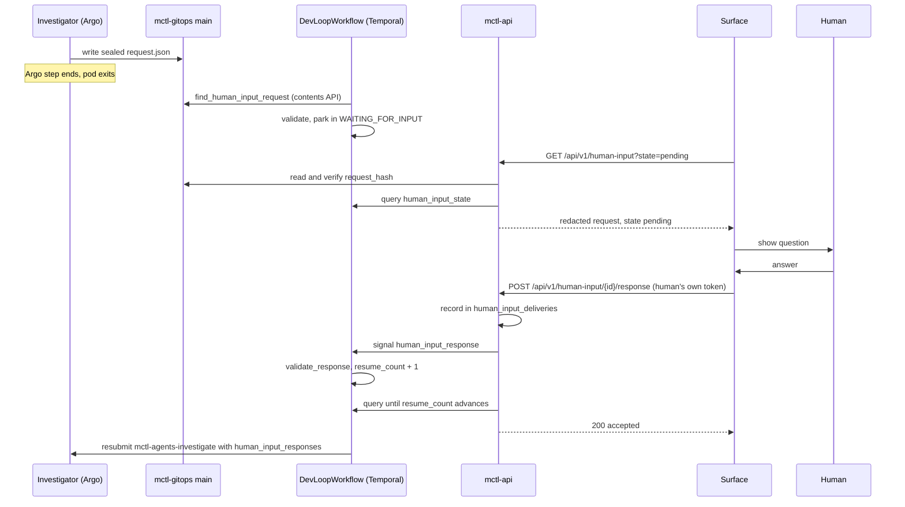

# Human Input: Architecture

Human input is the platform primitive that lets a DevLoop agent stop, ask a human a question, and continue with the answer. It is separate from human approval: an answer is information, never authorization (see [Semantics](/human-input/semantics)).

This page describes what exists on `main` today. It does not define the contract.

::: info Normative source
The contract is **ADR 013** in mctl-agents: [`docs/adr/013-human-input-contract.md`](https://github.com/mctlhq/mctl-agents/blob/main/docs/adr/013-human-input-contract.md). The code of record is [`orchestrator/human_input.py`](https://github.com/mctlhq/mctl-agents/blob/main/orchestrator/human_input.py). Where this page and ADR 013 disagree, ADR 013 wins.

The tracking issue ([mctl-docs#106](https://github.com/mctlhq/mctl-docs/issues/106)) refers to ADR 009. ADR 009 is the ContextSnapshot contract; the human-input contract was numbered 013.
:::

::: warning Status
- **Consumer side: built.** `DevLoopWorkflow` reads, validates and waits on a request, and resumes on a valid answer ([mctl-agents#333](https://github.com/mctlhq/mctl-agents/issues/333)).
- **Read model and response API: merged, not yet released.** [mctl-api#261](https://github.com/mctlhq/mctl-api/issues/261) (PRs #346, #348) ships with release PR [mctl-api#340](https://github.com/mctlhq/mctl-api/pull/340).
- **Producer side: not built.** Nothing on `main` writes a request yet. The capability is listed in the catalog profile ([mctl-gitops#1277](https://github.com/mctlhq/mctl-gitops/issues/1277)) but stays inert, and the remaining producer work is tracked in [mctl-agents#451](https://github.com/mctlhq/mctl-agents/issues/451).
- **Surfaces: none shipped.** Telegram ([mctl-telegram#571](https://github.com/mctlhq/mctl-telegram/issues/571)) and the Portal Execution Canvas ([mctl-portal#124](https://github.com/mctlhq/mctl-portal/issues/124)) are both blocked.
:::

## Components

| Component | Repository | Role |
|-----------|------------|------|
| Contract (`HumanInputRequest`, `HumanInputResponse`) | mctl-agents `orchestrator/human_input.py` | Schema, sealing, hashing, `validate_response`. Stdlib only; runs in the agent sandbox and as pure Temporal workflow code |
| Request document | mctl-gitops `main` | One sealed `request.json` per proposal. This is the transport |
| `find_human_input_request` activity | mctl-agents `orchestrator/temporal/activities/human_input.py` | GitHub contents-API read of the request file |
| `DevLoopWorkflow` | mctl-agents `orchestrator/temporal/workflows/dev_loop.py` | Parks in `WAITING_FOR_INPUT`, validates answers, resubmits the investigator |
| Read model and response endpoint | mctl-api `internal/api/handlers_human_input*.go` | Lists and verifies requests, derives state from the workflow, delivers answers as a Temporal signal |
| Delivery ledger | mctl-api `internal/humaninput/ledger_postgres.go` | Postgres table `human_input_deliveries`: idempotency and recoverable delivery |
| Surfaces | mctl-telegram, mctl-portal, others | Render requests and submit answers through mctl-api. They hold no state of their own |

The request file lives at:

```
platform-gitops/agents-state/<service>/proposals/<slug>/human-input/request.json
```

There is at most one per proposal. A re-asking investigator overwrites it, and an answered request is not removed, so the set of files is the set of requests that exist, not the set that are pending. Only the owning workflow knows whether a request is pending.

## Flow



1. The investigator decides it cannot proceed without a human decision and writes one sealed `HumanInputRequest` to its proposal's `human-input/` directory. **Not built yet** (see Status).
2. After the investigate step succeeds, `DevLoopWorkflow` looks up the proposal slug and calls `find_human_input_request`. A 404 means no request; anything else non-200 is retried.
3. The workflow parses the document with `HumanInputRequest.from_dict`, which recomputes `question_hash`, `request_hash` and `request_id` and rejects a mismatch. A malformed document fails the execution with the non-retryable error type `human_input_malformed`.
4. Leftovers are skipped (a question already answered in this execution, a request sealed by another workflow or run, one created before this run started, or one already expired). Otherwise the workflow enters `WAITING_FOR_INPUT`.
5. A surface reads the request from mctl-api, shows it, and submits the human's answer to mctl-api, authenticated as that human.
6. mctl-api checks eligibility, `request_hash`, expiry and the value type, records the answer in its ledger, and sends the `human_input_response` signal.
7. The workflow re-validates the answer with `validate_response`. On success it increments its resume count, returns to `RUNNING`, and resubmits `mctl-agents-investigate` with every answer accepted so far. It then checks again for a new request, bounded by `MAX_CLARIFICATION_ROUNDS`.

The clarification branch runs only on executions that pass `workflow.patched("human-input")`, so histories recorded before the feature replay unchanged.

## No pod held while waiting

The wait is a Temporal `wait_condition` with a timeout. No Argo workflow, Claude Agent SDK session or activity slot is held during the wait. Only the `find_human_input_request` read before it, and one more investigate submission when a continuation runs, use resources. A loop can stay in `WAITING_FOR_INPUT` for days at the cost of Temporal history storage.

## State model

Three separate vocabularies are in play. They must not be confused.

### Workflow state (`human_input_state` query)

The Temporal query `human_input_state` on `DevLoopWorkflow` returns `HumanInputState`:

| Field | Meaning |
|-------|---------|
| `state` | `RUNNING`, `WAITING_FOR_INPUT` or `INPUT_TIMED_OUT` |
| `request_id`, `request_hash`, `question_hash` | The request currently or last waited on |
| `expires_at` | As sealed in the request |
| `effective_deadline` | The deadline the wait actually uses. Differs from `expires_at` when a far-future value was clamped |
| `round` | Producer-written round number |
| `resume_count` | Answers this execution has accepted |
| `rejected_count` | Payloads this execution refused (invalid, arrived while not waiting, or over the queue cap) |

A workflow that never waited returns the all-empty shape (`RUNNING`, zero counters), so pollers can call the query unconditionally. `state` is never `WAITING_FOR_APPROVAL`: that name belongs to the separate approval gate.

When the wait concludes, the workflow records one of three outcomes: `answered`, `timed_out` (the loop ends with `human input wait expired for request <id>`) or `abandoned` (the operator `abandon` signal, which wins over an answer racing it).

### Read-model state (mctl-api)

mctl-api keeps no copy of the state machine. Each read derives a request's state from its sealed `expires_at` and the owning workflow's `human_input_state`:

| State | Derived when |
|-------|--------------|
| `pending` | The workflow reports `WAITING_FOR_INPUT` for this `request_id` and `expires_at` is in the future. The only state an answer is accepted in |
| `expired` | `expires_at` has passed, and the workflow is waiting on it or cannot be asked |
| `timed_out` | The workflow reports `INPUT_TIMED_OUT` for this request |
| `resolved` | The workflow reports `RUNNING` for this request with `resume_count > 0` |
| `not_pending` | The workflow is waiting on a different request, on none, or no longer exists |
| `unknown` | The workflow did not answer, returned no state, or reported an unrecognised state |

A workflow that was terminated or failed while parked still answers the query with its last state, so its request reads as `pending` until `expires_at`. An answer to it is refused, because signalling a closed execution fails.

### Delivery state (mctl-api ledger)

The ledger records what mctl-api did with an answer. It is not the request's state:

| State | Meaning |
|-------|---------|
| `pending_delivery` | Recorded, not yet confirmed by the workflow. The value is retained so any later call can redeliver it |
| `accepted` | The workflow resumed on this answer. Terminal |
| `rejected` | The workflow refused it, or the request stopped waiting first. Frees the request for another submission |

## Continuation

Every continuation resubmits `mctl-agents-investigate` with the full set of accepted answers as the `human_input_responses` parameter, a JSON array with one entry per answer:

```json
[
  {
    "request_id": "hir-377a93a48528eb13",
    "request_hash": "sha256:…",
    "value": "option-b",
    "respondent": "github:alice",
    "surface": "telegram",
    "received_at": "2026-09-23T10:15:00Z"
  }
]
```

The full history is sent, not just the latest answer, so a later round never re-asks an earlier question.

::: warning Not yet wired end to end
The `mctl-agents-investigate` CWFT on mctl-gitops `main` does not declare `human_input_responses`, and nothing in the investigator reads it. Pinning the parameter against the CWFT is tracked in [mctl-agents#451](https://github.com/mctlhq/mctl-agents/issues/451). No step on `main` folds answers into a new ContextSnapshot; the parameter above is the whole continuation context.
:::

## Log and audit events

`DevLoopWorkflow` logs the following events. Every one carries ids, hashes, timestamps and counters only, never `question`, `reason` or `value`.

| Event | Emitted when |
|-------|--------------|
| `human_input.foreign_execution` | A request was sealed by another workflow id or run, or predates this run; skipped |
| `human_input.stale_expired` | A request was already expired when read; skipped as a leftover |
| `human_input.requested` | A valid request for this execution was found |
| `human_input.wait_started` | The workflow entered `WAITING_FOR_INPUT` |
| `human_input.expiry_clamped` | `expires_at` exceeded now + `MAX_REQUEST_TTL_SECONDS` and was clamped |
| `human_input.delivered` | A queued answer payload is about to be validated |
| `human_input.responded` | An answer was validated; `accepted` is `true` or `false` |
| `human_input.resumed` | An accepted answer resumed the loop |
| `human_input.timed_out` | The deadline passed with no accepted answer |
| `human_input.abandoned` | The `abandon` signal ended the wait |
| `human_input.cancelled` | The workflow was cancelled while waiting |

There is no `human_input.answered` event; an accepted answer produces `human_input.responded` with `accepted: true`, followed by `human_input.resumed`.

mctl-api writes audit entries for submissions with the operations `human_input.signal_sent`, `human_input.response_accepted` and `human_input.response_rejected`. They also carry ids only.

## Related

- [Semantics](/human-input/semantics): clarification vs approval, and the bounds
- [Surface adapter guide](/human-input/surface-adapters): the mctl-api read model and response endpoint
- [Agent author guide](/human-input/agent-authors): the `human.request_input` capability and continuation
- Roadmap epic: [mctlhq/.github#42](https://github.com/mctlhq/.github/issues/42)
