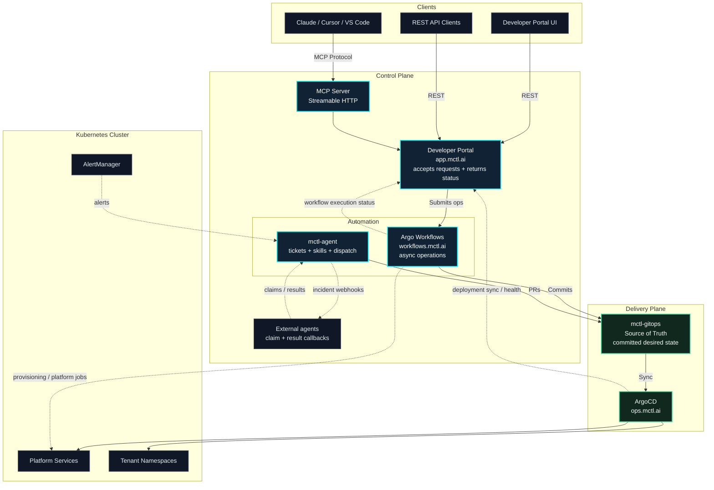

# Architecture

MCTL follows a GitOps architecture where every infrastructure change flows through Git.

## System Diagram

## Request Flow

### MCP Request

1. AI client sends a tool call via Streamable HTTP to `api.mctl.ai/mcp`
2. `mctl-api` authenticates the request (GitHub token, Dex JWT, or OAuth JWT)
3. The handler validates input and checks RBAC for the tenant
4. `mctl-api` submits an Argo Workflow for the requested operation
5. An operation ID is returned immediately
6. The workflow commits the desired state to `mctl-gitops`
7. ArgoCD detects the change and syncs the cluster
8. The client polls `mctl-api` for workflow execution status and deployment sync/health

### Self-Healing Flow

1. AlertManager fires an alert (e.g., pod crash loop)
2. `mctl-agent` receives the alert webhook and creates a ticket
3. Evidence is collected and a skill is selected for diagnosis
4. The agent either prepares a direct fix PR or dispatches the incident to an external agent such as OpenClaw
5. A fix lands in `mctl-gitops` as a PR rather than mutating the cluster directly
6. On merge, ArgoCD syncs the change

## Data Flow

| Path | Protocol | Auth |
|------|----------|------|
| Client -> MCP Server | Streamable HTTP (POST/GET) | Bearer token per request |
| Client -> REST API | HTTPS | GitHub token / Dex JWT / OAuth JWT |
| Argo Workflows -> GitOps | Git (SSH) | Deploy key |
| ArgoCD -> Cluster | Kubernetes API | ServiceAccount |
| AlertManager -> Agent | Webhook (HTTP) | Internal network |
| Agent -> External agents | Signed webhook callbacks | Shared secret / callback auth |
