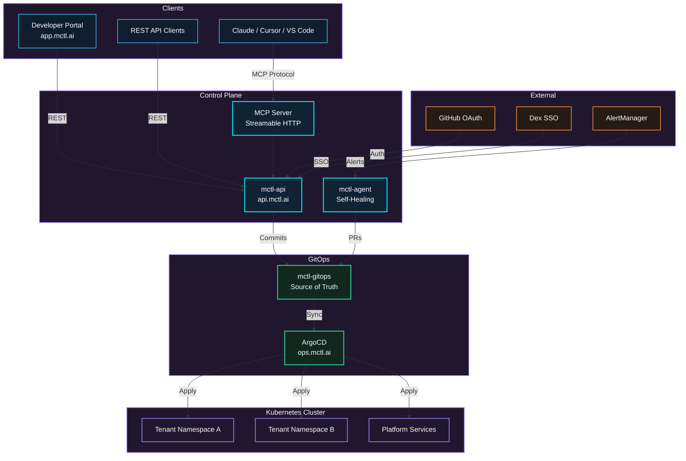

# Architecture

MCTL follows a GitOps architecture where every infrastructure change flows through Git.

## System Diagram

## Request Flow

### MCP Request

1. AI client sends a tool call via Streamable HTTP to `api.mctl.ai/mcp`
2. `mctl-api` authenticates the request (GitHub token, Dex JWT, or OAuth JWT)
3. The handler validates input and checks RBAC for the tenant
4. A Git commit is created in `mctl-gitops` with the desired state
5. An operation ID is returned immediately
6. ArgoCD detects the change and syncs the cluster
7. An Argo Workflow runs to execute the operation
8. The client can poll the operation status until completion

### Self-Healing Flow

1. AlertManager fires an alert (e.g., pod crash loop)
2. `mctl-agent` receives the alert webhook
3. The agent analyzes the alert using Claude API
4. A skill is selected and executed (e.g., increase memory, rollback)
5. A PR is created in `mctl-gitops` with the fix
6. On merge, ArgoCD syncs the change

## Data Flow

| Path | Protocol | Auth |
|------|----------|------|
| Client -> MCP Server | Streamable HTTP (POST/GET) | Bearer token per request |
| Client -> REST API | HTTPS | GitHub token / Dex JWT / OAuth JWT |
| API -> GitOps | Git (SSH) | Deploy key |
| ArgoCD -> Cluster | Kubernetes API | ServiceAccount |
| AlertManager -> Agent | Webhook (HTTP) | Internal network |
