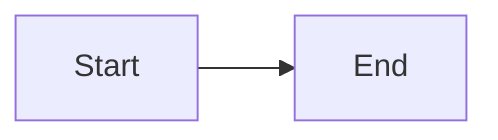
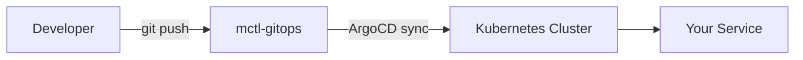
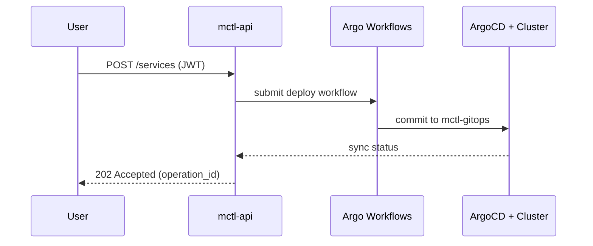
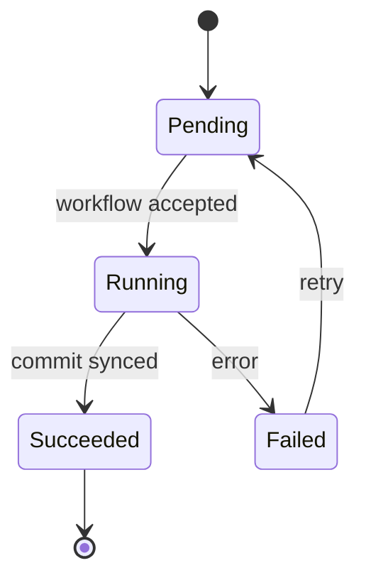
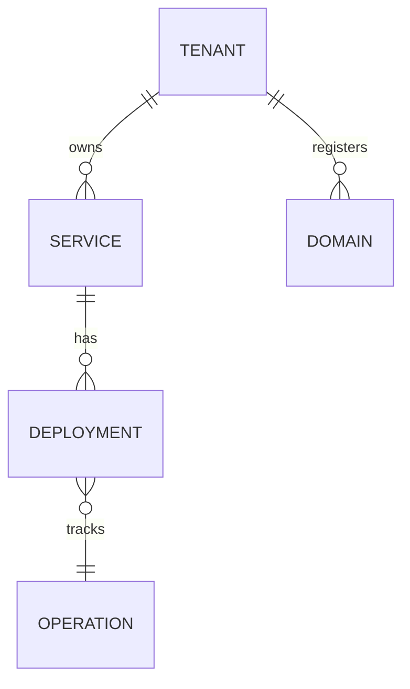
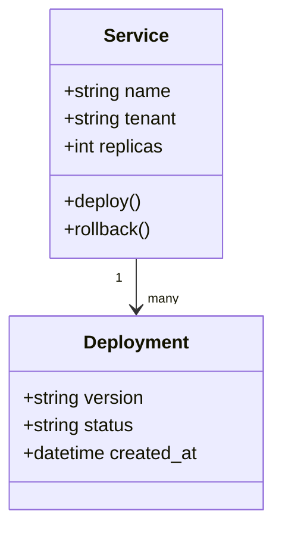
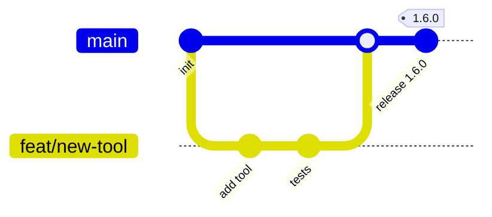
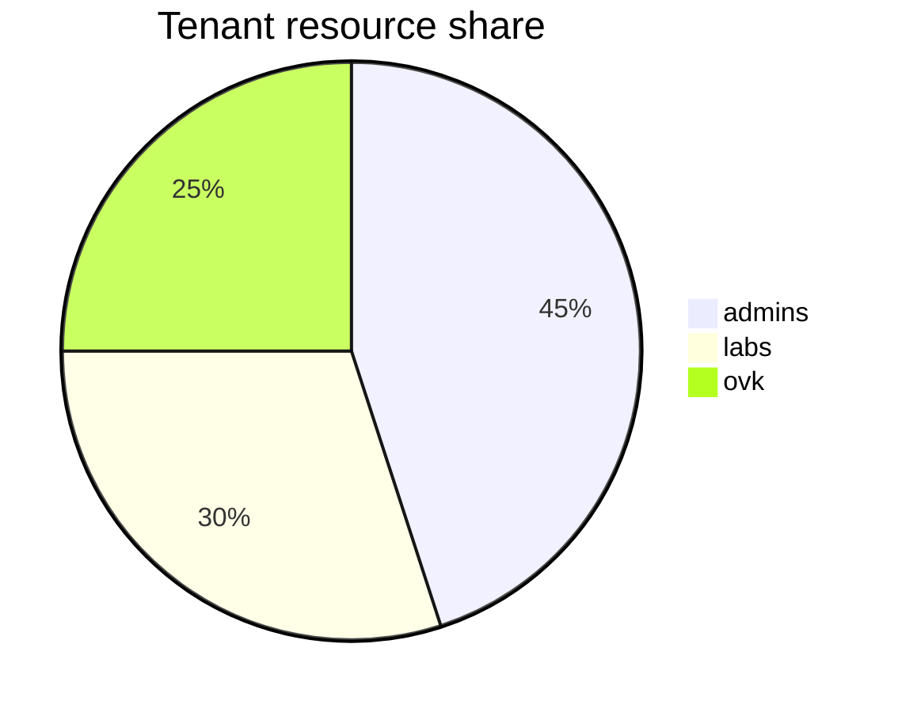
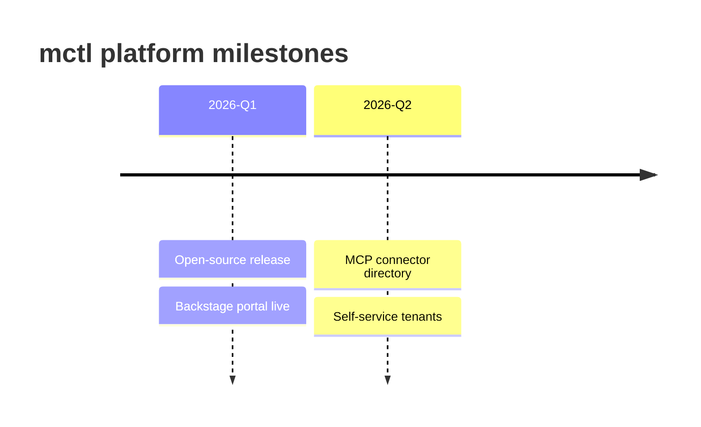
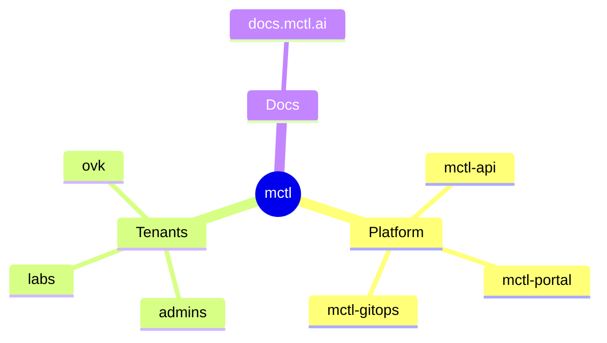

# Diagram Types

mctl docs uses [Mermaid](https://mermaid.js.org/) (currently `11.13.x`) for every diagram in the site. Any Markdown file under `docs/` can include a fenced `mermaid` block — the custom fence handler in `docs/.vitepress/config.ts` converts it to a `<div class="mermaid-diagram">` placeholder and the browser renders the source client-side.

````markdown

````

> **Version note:** the examples below are validated against mermaid `11.13.0`. Beta diagram types (Venn, Wardley Maps, Treemap variants) are deliberately **not** included until we bump mermaid and verify rendering. See [ADR 0003](https://github.com/mctlhq/mctl-docs/blob/main/context/decisions/0003-vitepress-2-upgrade-strategy.md) for the upgrade policy.

## When to use a diagram

- For structural relationships, request flows, or state machines that a paragraph cannot convey concisely.
- Skip the diagram if a sentence does the job.
- Keep diagrams small — large flowcharts become unreadable on mobile.
- Label every node and edge clearly. Tenant names (`admins`, `labs`, `ovk`) should be written literally.
- Never embed secrets, internal IPs, or unredacted hostnames in diagram labels.

## Supported diagram types

| Type | Status | Best for |
|------|--------|----------|
| Flowchart (`flowchart` / `graph`) | Stable | Process flows, decision trees |
| Sequence (`sequenceDiagram`) | Stable | API call sequences, auth flows |
| State (`stateDiagram-v2`) | Stable | Service lifecycles, state machines |
| ER (`erDiagram`) | Stable | Data model relationships |
| Class (`classDiagram`) | Stable | API / object schema relationships |
| Git graph (`gitGraph`) | Stable | Branching strategies, release flow |
| Pie (`pie`) | Stable | Proportions, quota usage |
| Timeline (`timeline`) | Stable | Chronological roadmaps |
| Mindmap (`mindmap`) | Stable | Concept maps |
| Architecture (`architecture-beta`) | Beta | High-level system component layouts |

## Examples

### Flowchart



### Sequence diagram



### State diagram



### ER diagram



### Class diagram



### Git graph



### Pie chart



### Timeline



### Mindmap



### Architecture (beta)

::: warning Beta
The `architecture-beta` diagram type is still marked beta upstream. Rendering may change in future mermaid releases.
:::


## Notes for contributors

- The fence handler runs at build time and only embeds the source string — Mermaid renders in the browser, so syntax errors will show up as a broken diagram on the page rather than a build failure. Always verify locally with `npm run dev`.
- Avoid the deprecated `htmlLabels` option in flowchart configs (deprecated since mermaid 11.13). The default rendering already produces the same result.
- If you need a diagram type that is not in the table above, open a PR adding both an example here and a reference link to the mermaid documentation, so the next contributor knows it is supported in our stack.
